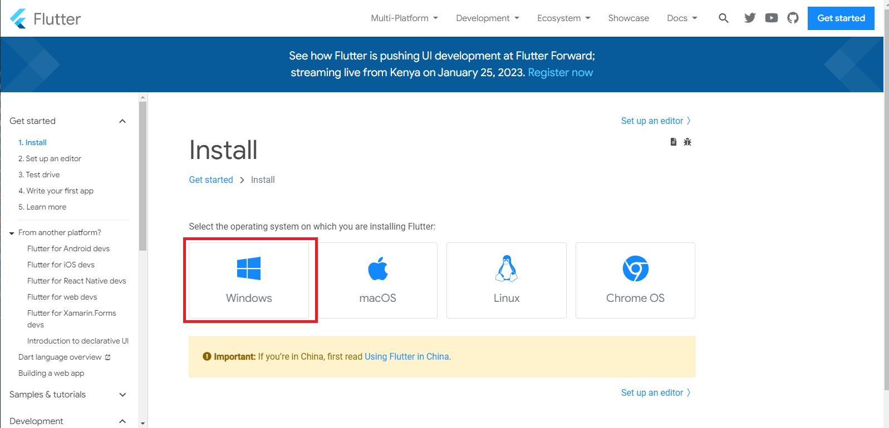
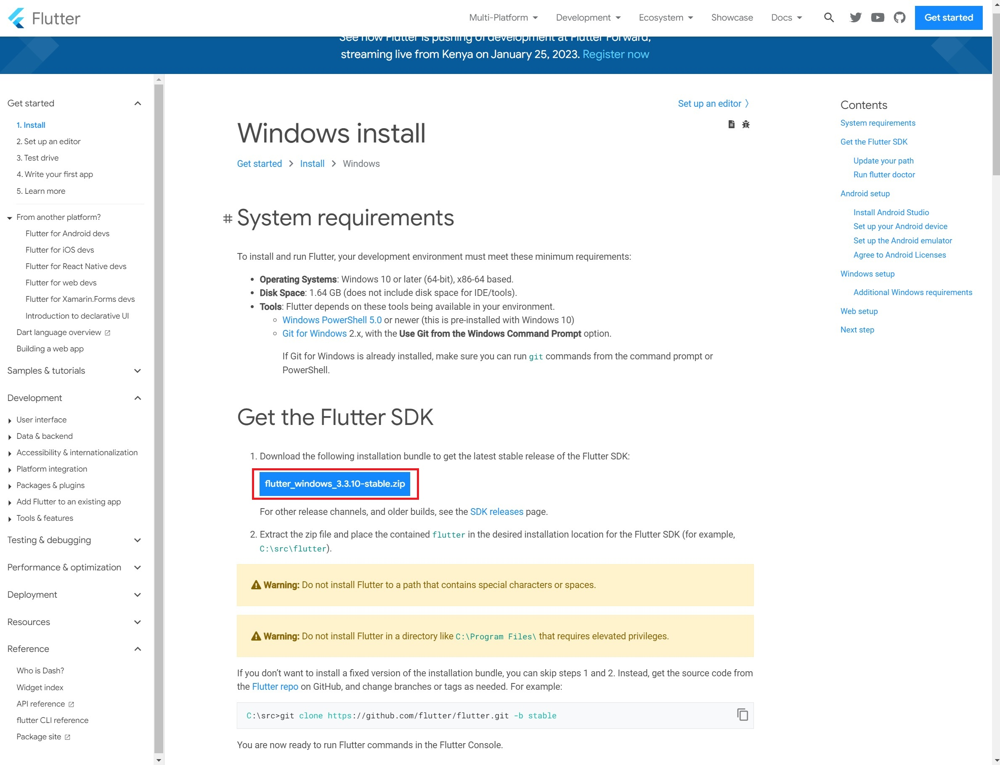
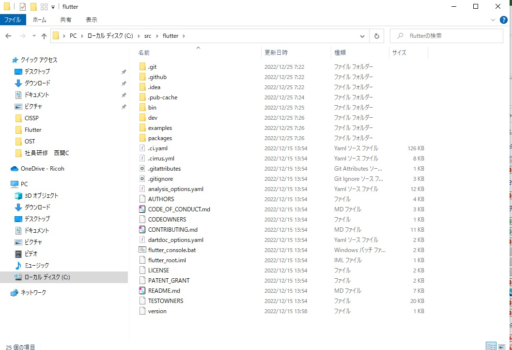
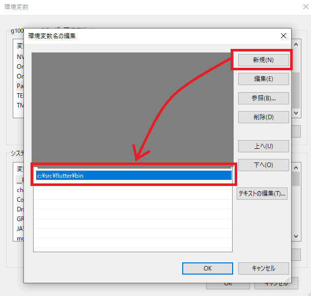
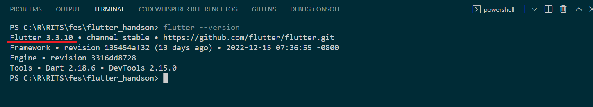
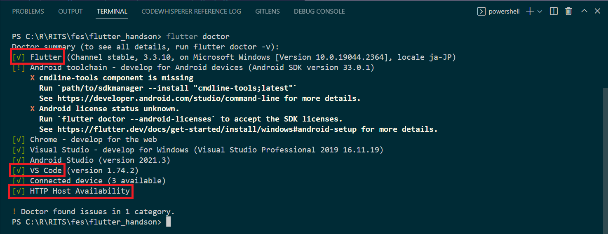
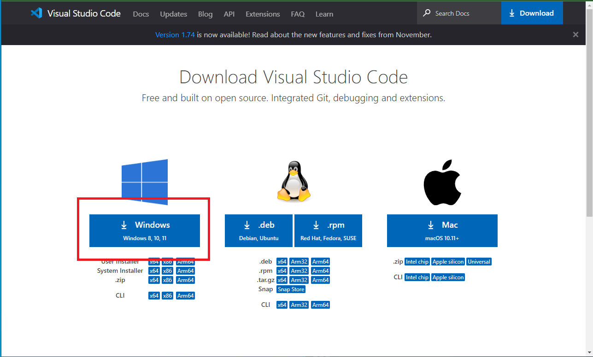
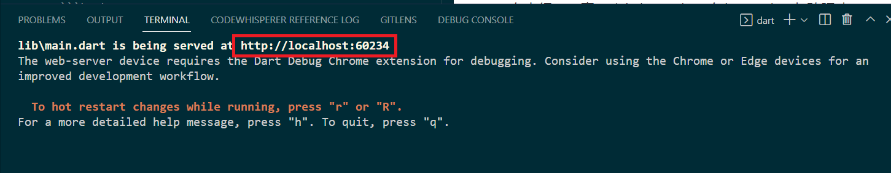
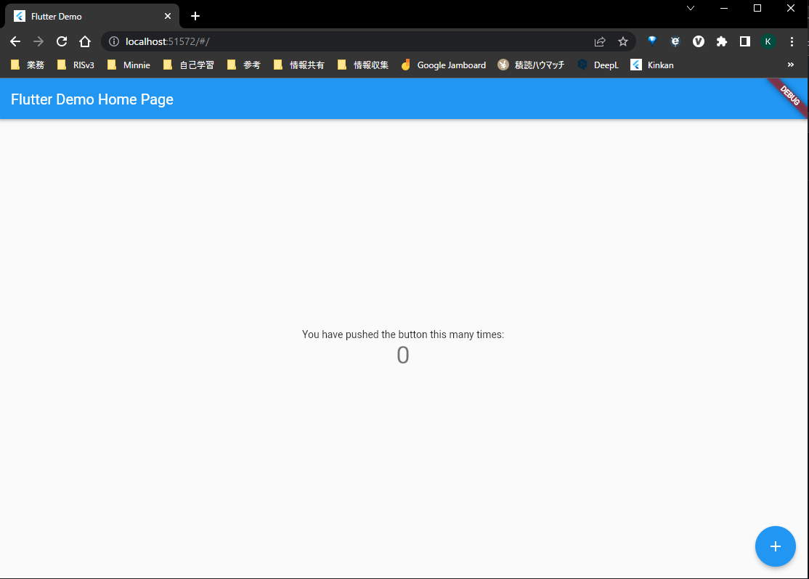
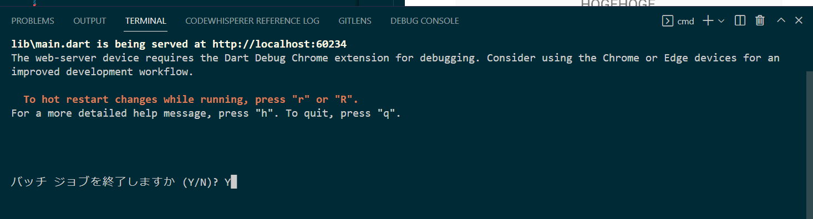

# flutter_handson


## セットアップ

1. Flutter [公式サイト](https://flutter.dev/)より「Get Started」を選択
   
2. インストールする先のOSを選択
   
   （↑の選択はWindowsの場合）
3. FlutterSDK（.zipファイル)をダウンロード
   
4. .zipファイルを解凍し、flutterフォルダを任意の場所に配置します。（例： C:\src\flutter）
   <p class="alert">**注意** 特殊文字やスペースを含むパスに配置しないでください。</p>
   <p class="alert">**注意** ProgramFilesやWindowsフォルダなど、特権の昇格権限が必要な場所に配置しないでください。</p>
   
5. パスを通す
   環境変数 Pathに flutterディレクトリの中にあったbinフォルダにパスを通します。
   
   (上記は C:\src\flutter\binの場合)
6. パスが通っていることの確認
   コマンドプロンプトを起動し以下のコマンドを実行します。
   ``` flutter --version ```
   下記のようにバージョンが表示されればOKです。
   

7.  flutter doctor
   ``` flutter doctor ```
   * 警告が表示されることがありますが今回は、Flutter,VS Code, HTTP Host Availabilityが有効（<span style="color: green; ">[√]</span>）となっていれば今回のハンズオンは進められます。（過去にFlutterを導入していない殆どの人が警告が出ると想定されます）

8. [VSCode](https://code.visualstudio.com/download)をインストール
  
   - オプション：Extensions（拡張機能） に「Dart」と「Flutter」を入れておくと便利です。
  
9. [このリポジトリ](https://github.com/XPKaigi/flutter_hands_on) をクローンしてください。

10. クローンしたリポジトリ以下で以下のコマンドを実行します。
   ```flutter run -d web-server```
   
   
   表示されたURLをクリック、あるいはブラウザで開きます。
   
   上記画面が表示されればOKです。
   ターミナルを Ctrl-C キー→Yキー押下で終了します。
   
   
# Flutter

### ネイティブ・その他のフレームワークによる開発者向け
[公式のfor XXX](https://docs.flutter.dev/get-started/flutter-for/android-devs)で各ネイティブ・その他のフレームワークによる開発者向けにFlutterとの対比をわかりやすく説明してくれているので、経験者はここから入ると捗る。


# Dartの基本文法
[text/introduction_dart.md](text/introduction_dart.md)

さらに詳しく学ぶ場合は[公式ドキュメント](https://dart.dev/guides)を参照